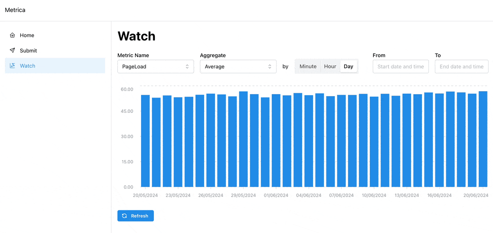

# Table of Contents
- [Table of Contents](#table-of-contents)
- [The Project](#the-project)
  - [Functional requirements](#functional-requirements)
  - [Non-functional requirements](#non-functional-requirements)
- [Grafana](#grafana)
- [The Application](#the-application)
  - [Quick demo](#quick-demo)
  - [Usage](#usage)
    - [WEB UI](#web-ui)
      - ["Submit" page](#submit-page)
      - ["Watch" page](#watch-page)
    - [API](#api)
      - [GET /api/metric](#get-apimetric)
      - [POST /api/metric](#post-apimetric)
  - [Assumptions](#assumptions)
  - [Improvement Areas](#improvement-areas)
  - [Tradeoffs](#tradeoffs)
  - [How to run locally](#how-to-run-locally)
- [API Documentation \& Endpoints](#api-documentation--endpoints)
  - [`GET /api/metric`](#get-apimetric-1)
    - [Description](#description)
    - [Request Payload](#request-payload)
    - [Example Request](#example-request)
    - [Example Response](#example-response)
    - [Error Responses](#error-responses)
    - [Example Error Response](#example-error-response)
  - [`POST /api/metric`](#post-apimetric-1)
    - [Description](#description-1)
    - [Request Payload](#request-payload-1)
    - [Example Request](#example-request-1)
    - [Example Response](#example-response-1)
    - [Error Responses](#error-responses-1)
    - [Example Error Response](#example-error-response-1)
# The Project

## Functional requirements
> We need a Frontend + Backend application that allows you to post and visualize metrics. Each metric will have: Timestamp, name, and value. The metrics will be shown in a timeline and must show averages per minute/hour/day The metrics will be persisted in the database.

## Non-functional requirements
- TBD


&nbsp;

&nbsp;

# Grafana

I've built a Grafana dashboard to visualize the metrics.

The dashboard is connected to the same data source as the application.

You can find the board here: [Board link](https://advertion.grafana.net/public-dashboards/e5911a5dd6ca454a95c88741b6ff7884).

# The Application
The application is built using JS/TS stack with [Next.js](https://nextjs.org/) and deployed to [Vercel](https://vercel.com/).

Live preview: [https://assignment-metrica.vercel.app/](https://assignment-metrica.vercel.app/)


## Quick demo



## Usage
### WEB UI
#### "Submit" page 
Let's you submit metrics to the application.
#### "Watch" page 
Let's you visualise metrics submitted to the application.
### API
#### GET /api/metric
See [`GET /api/metric`](#get-apimetric-1)
#### POST /api/metric
See [`POST /api/metric`](#post-apimetric-1)

## Assumptions
- The Backend
  - TypeScript & Next.js.
  - API endpoints are deployed as Serverless Vercel Functions (aka AWS lambdas).
  - [Prisma ORM](https://www.prisma.io/) is used for DB operations.
- The Frontend
  - ReactJS & [Next.js](https://nextjs.org/).
  - React Component library: [Mantine](https://mantine.dev/).
- Hosting and Deployemnt Infrastructure: Vercel.
- Database: PostgreSQL (Vercel).
- Database is seeded with 10 000 random metrics. See `./prisma/seed.ts` for details.
- No complex infra such as WAF, Load Balancer etc.
- No Auth.
- No Tests.
- No Local dev infra such as Docker for local dev DB etc.


## Improvement Areas
- Caching on the Frontend.
- Various visulisation improvements such as showing more than one metric on the same graph etc.
- Add pagination to the API "Watch" page
- Realtime data update.
- Come up with solution to store metric names. E.g. Separate DB\ Table. With indicies for faster lookups etc. 
- Consider NoSQL db. E.g. MongoDB for large scale data storage and high write throughput.
- Add middleware to validate payload data types
- Autogenerate api docs with Swagger and OpenAPI
- Consider empty states
- Code clean up such as
  - Move types to external file
  - Move some handlers and utils to separate files etc
- Consider points from Tradeoffs section


## Tradeoffs
Following tradeoffs have been made:
- No Tests
- No Auth
- No Pagination
- No Error handling
- No Logging & Monitoring
- No Rate limiting

## How to run locally

**Requirements: Node.js 18.17 or later**

1. Clone the repository `git clone git@github.com:pvshum/assignment-metrica.git`
2. `cd assignment-metrica`
   - Either use provided `.env` file or rename `.env.example` to `.env` and add your own values.
1. Run `npm install`
2. Now we need to seed the DB. 
   - Run `npx prisma migrate deploy` to apply latest migrations.
   - If you use provided `.env` file you can skip db seeding and proceed to step 3
   - If you use own DB, you can seed it with data using `npx prisma db seed`  
     - This will create 10k metrics. 
3. Run `npm run dev`
4. Open http://localhost:3000 with your browser to see the application.
5. To inspect the DB you can use Prisma Studio. Run `npx prisma studio`

&nbsp;
&nbsp;


# API Documentation & Endpoints

## `GET /api/metric`

### Description
Returns aggregated metrics for a specified metric name. The aggregation can be based on average, maximum, or count of the metric values over specified intervals.

### Request Payload

| Field      | Type     | Required | Description                                             |
|------------|----------|----------|---------------------------------------------------------|
| `name`     | `string` | Yes      | The name of the metric to retrieve. Current supported names: `PageLoad`, `APIRequest`, `Login`, `Signup`, `Search`. |
| `aggregate`| `string` | No       | The type of aggregation (`avg`, `max`, `count`). Default is `avg`. |
| `interval` | `string` | No       | The interval for aggregation (`minute`, `hour`, `day`). Default is `day`. |
| `timeFrom` | `string` | No       | The start time for the metrics retrieval in format parseable by `new Date()`. No Default.|
| `timeTo`   | `string` | No       | The end time for the metrics retrieval in format parseable by `new Date()`. No Default.|

### Example Request
Query string:
```
/api/metric?name=PageLoad&aggregate=avg&interval=hour&timeFrom=2024-06-01T00:00:00Z&timeTo=2024-06-20T00:00:00Z
```

Query params:
```json
{
  "name": "PageLoad",
  "aggregate": "avg",
  "interval": "hour",
  "timeFrom": "2024-06-01T00:00:00Z",
  "timeTo": "2024-06-20T00:00:00Z"
}
```


### Example Response
```json
{
  "name": "PageLoad",
  "aggregate": "avg",
  "interval": "hour",
  "metrics": [
    {
      "time": "2024-06-01T00:00:00Z",
      "avg": 22.5
    },
    {
      "time": "2024-06-01T01:00:00Z",
      "avg": 23.0
    }
  ]
}
```

### Error Responses

| Status Code | Message                          | Description                                     |
|-------------|----------------------------------|-------------------------------------------------|
| 400         | `RESPONSE_MESSAGES.EMPTY_METRIC_NAME`  | The metric name is missing.                     |
| 405         | `RESPONSE_MESSAGES.METHOD_NOT_ALLOWED` | The request method is not allowed (only `GET` is allowed). |


### Example Error Response
```json
{
  "error": "RESPONSE_MESSAGES.EMPTY_METRIC_NAME"
}
```
```json
{
  "error": "RESPONSE_MESSAGES.METHOD_NOT_ALLOWED"
}
```
---


&nbsp; 

&nbsp; 

## `POST /api/metric`

### Description
Creates a new metric entry.

### Request Payload

| Field       | Type     | Required | Description                                      |
|-------------|----------|----------|--------------------------------------------------|
| `name`      | `string` | Yes      | The name of the metric.                          |
| `value`     | `number` | Yes      | The value of the metric.                         |
| `timestamp` | `string` | No       | The timestamp of the metric in format parseable by `new Date()`.  |

### Example Request
```json
{
  "name": "PageLoad",
  "value": 23.5,
  "timestamp": "2024-06-20T14:30:00Z"
}
```

### Example Response
```json
{
  "id": "clxncpdto000213h0kz22kt50",
  "name": "PageLoad",
  "value": 23.5,
  "timestamp": "2024-06-20T14:30:00Z"
}
```

### Error Responses

| Status Code | Message                                  | Description                            |
|-------------|------------------------------------------|----------------------------------------|
| 400         | `RESPONSE_MESSAGES.EMPTY_METRIC_NAME`    | The metric name is missing.            |
| 400         | `RESPONSE_MESSAGES.EMPTY_METRIC_VALUE`   | The metric value is missing.           |
| 405         | `RESPONSE_MESSAGES.METHOD_NOT_ALLOWED`   | The request method is not allowed (only `POST` is allowed).     |

### Example Error Response
```json
{
  "error": "RESPONSE_MESSAGES.EMPTY_METRIC_NAME"
}
```
```json
{
  "error": "RESPONSE_MESSAGES.EMPTY_METRIC_VALUE"
}
```
```json
{
  "error": "RESPONSE_MESSAGES.METHOD_NOT_ALLOWED"
}
```


 